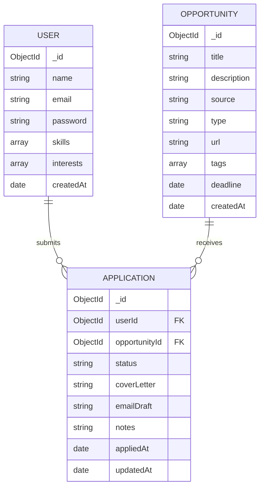

# Entity Relationship Diagram

Database schema showing how the three core entities relate to each other.

## Relationships

- A **User** can submit many **Applications** (one-to-many)
- An **Opportunity** can receive many **Applications** (one-to-many)
- Each **Application** links exactly one User to one Opportunity

## Status Values

Applications move through these states: `pending` → `submitted` → `accepted` or `rejected`
