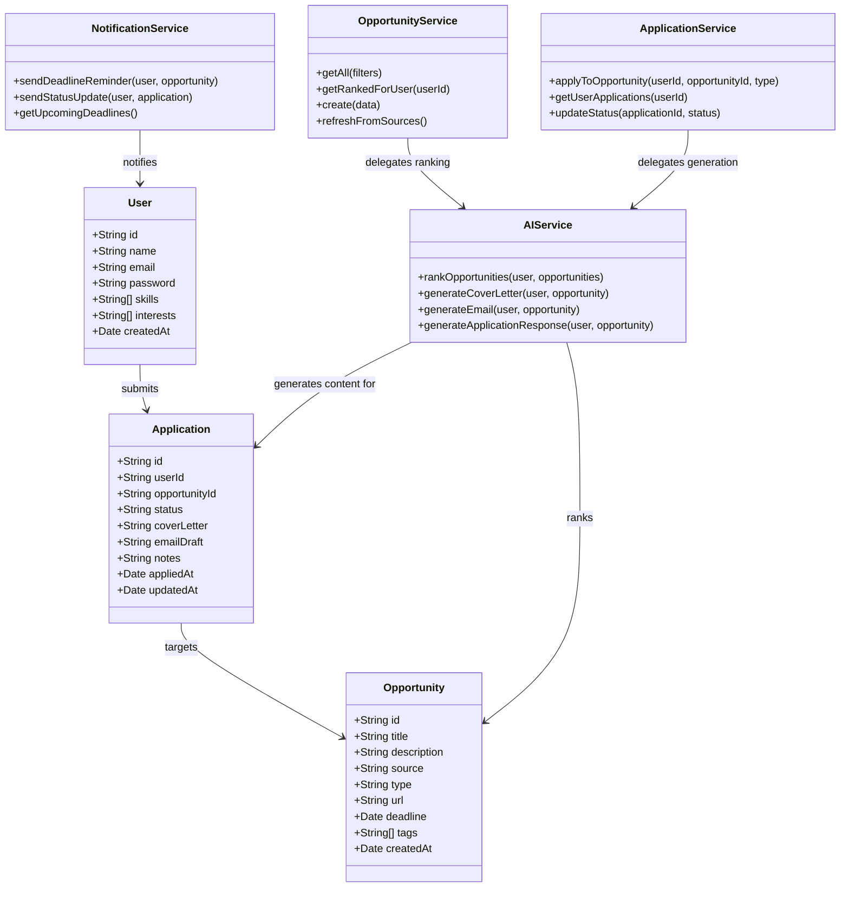

# Class Diagram

Shows the core classes in the system and their relationships.

```mermaid
classDiagram

    class User {
        +String id
        +String name
        +String email
        +String password
        +String[] skills
        +String[] interests
        +Date createdAt
    }

    class Opportunity {
        +String id
        +String title
        +String description
        +String source
        +String type
        +String url
        +Date deadline
        +String[] tags
        +Date createdAt
    }

    class Application {
        +String id
        +String userId
        +String opportunityId
        +String status
        +String coverLetter
        +String emailDraft
        +String notes
        +Date appliedAt
        +Date updatedAt
    }

    class AIService {
        +rankOpportunities(user, opportunities)
        +generateCoverLetter(user, opportunity)
        +generateEmail(user, opportunity)
        +generateApplicationResponse(user, opportunity)
    }

    class NotificationService {
        +sendDeadlineReminder(user, opportunity)
        +sendStatusUpdate(user, application)
        +getUpcomingDeadlines()
    }

    class OpportunityService {
        +getAll(filters)
        +getRankedForUser(userId)
        +create(data)
        +refreshFromSources()
    }

    class ApplicationService {
        +applyToOpportunity(userId, opportunityId, type)
        +getUserApplications(userId)
        +updateStatus(applicationId, status)
    }

    User --> Application : submits
    Application --> Opportunity : targets
    AIService --> Opportunity : ranks
    AIService --> Application : generates content for
    NotificationService --> User : notifies
    OpportunityService --> AIService : delegates ranking
    ApplicationService --> AIService : delegates generation
```
