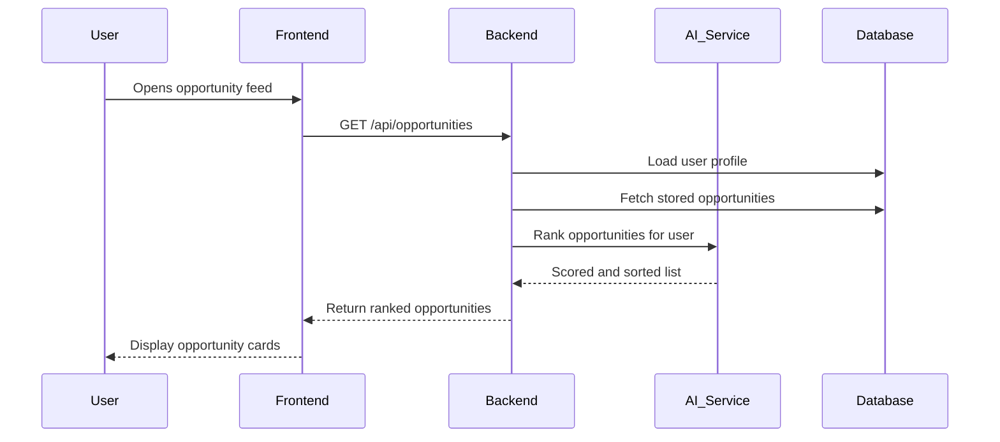
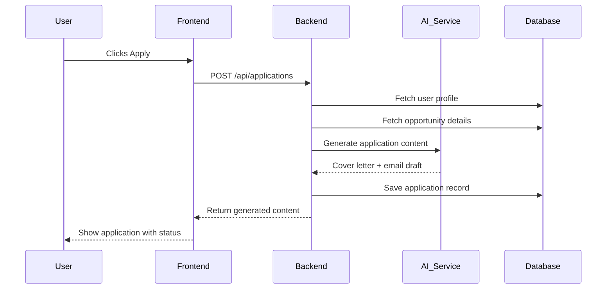
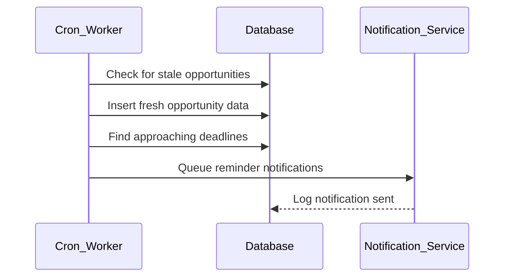

# Sequence Diagrams

## Fetching Ranked Opportunities

```mermaid
sequenceDiagram
    participant User
    participant Frontend
    participant Backend
    participant AI_Service
    participant Database

    User->>Frontend: Opens opportunity feed
    Frontend->>Backend: GET /api/opportunities
    Backend->>Database: Load user profile
    Backend->>Database: Fetch stored opportunities
    Backend->>AI_Service: Rank opportunities for user
    AI_Service-->>Backend: Scored and sorted list
    Backend-->>Frontend: Return ranked opportunities
    Frontend-->>User: Display opportunity cards
```

## Applying to an Opportunity

```mermaid
sequenceDiagram
    participant User
    participant Frontend
    participant Backend
    participant AI_Service
    participant Database

    User->>Frontend: Clicks Apply
    Frontend->>Backend: POST /api/applications
    Backend->>Database: Fetch user profile
    Backend->>Database: Fetch opportunity details
    Backend->>AI_Service: Generate application content
    AI_Service-->>Backend: Cover letter + email draft
    Backend->>Database: Save application record
    Backend-->>Frontend: Return generated content
    Frontend-->>User: Show application with status
```

## Background Opportunity Refresh

```mermaid
sequenceDiagram
    participant Cron_Worker
    participant Database
    participant Notification_Service

    Cron_Worker->>Database: Check for stale opportunities
    Cron_Worker->>Database: Insert fresh opportunity data
    Cron_Worker->>Database: Find approaching deadlines
    Cron_Worker->>Notification_Service: Queue reminder notifications
    Notification_Service-->>Database: Log notification sent
```
