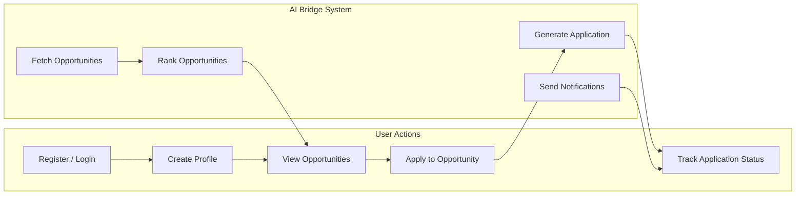

# Use Case Diagram

Shows how users interact with the AI Bridge system and what the system handles internally.

## Actor Descriptions

**User** — registers an account, fills out a profile with skills and interests, browses ranked opportunities, applies to selected ones, and monitors the status of submitted applications.

**AI Bridge System** — runs background fetching of opportunities from various sources, ranks them using the AI engine based on the user's profile, generates personalized application content when requested, and sends deadline reminders and status updates through the notification service.
